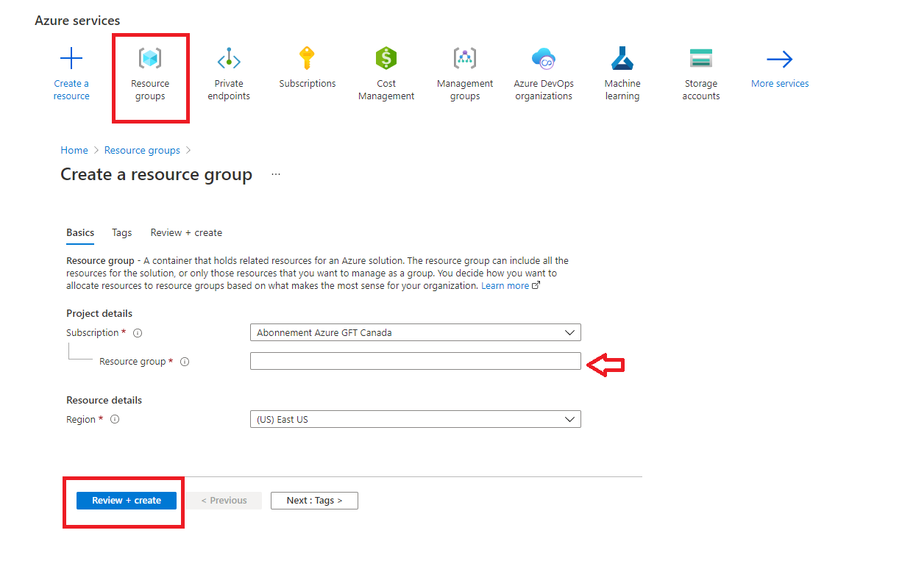
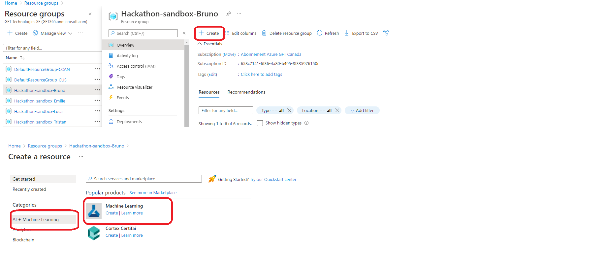
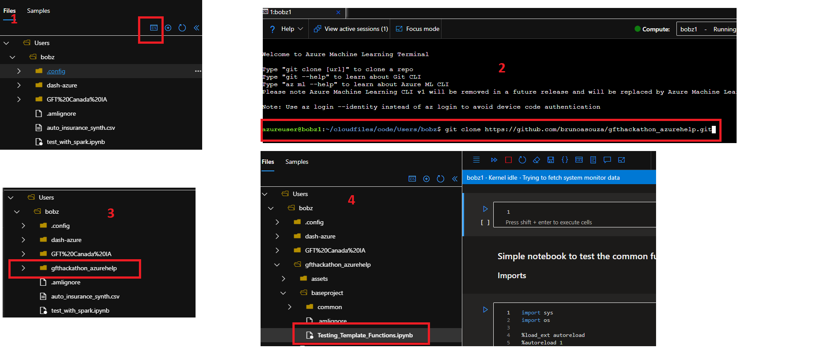
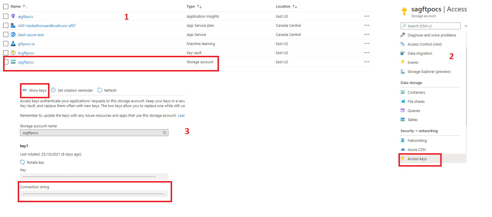

# Hackathon GFT Canada - Azure Integration Tutorial

This repository is intended to help the hackathon teams with Azure integration. We are providing some functions that will make it easier to manipulate the data inside the notebooks.

## Getting starting

To setup this project it's necessary:
- To create a ressource group in Azure:

- Into this ressource group, it's necessary to create an azure machine learning service:

- In your workspace azure, you have access to a terminal with git support and there, you can clone your repository:

- To access the azure machine learning service in portal azure and download the config.json file:

- Put the config.json in baseproject/common/

- To execute the read_data_from_blob function, it's necessary to add the connection string into the file config.json:
    1. In your ressource group, select the you store account
    2. Click in Access Keys
    3. Show keys
    4. Copy the connection string
    5. Open the config.json
    6. Create the key connection_string and paste your connection string value.

- Voilà!! You can continue others notebooks in the same level of the Testing_Template_Functions notebook

- If you prefer to use visual code, check this website: [link](https://docs.microsoft.com/en-us/azure/machine-learning/how-to-setup-vs-code)

