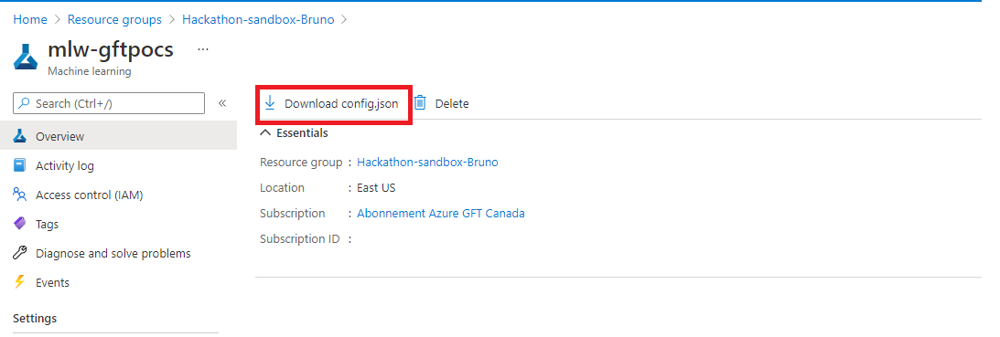
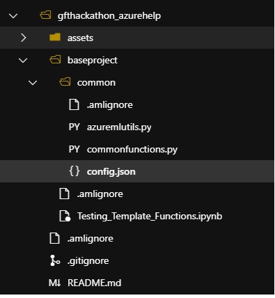

# GFT Canada IA repository

We use this repository to organise the IA projects.

## Getting starting

To setup this project it's necessary:

- To access the Azure Devops and clone the repository in your workspace:
- To access the azure machine learning service in portal azure and download the config.json file:

- Put the config.json in baseproject/common/

- Voilà!!